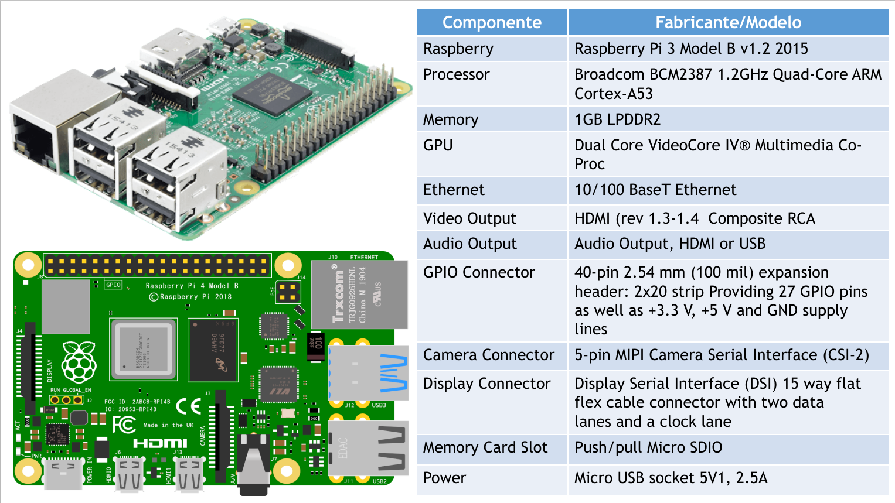

# Curso GRÁTIS de Raspberry Pi (Pi2, Pi 3, Pi 4, Pi Pico, Pi 400 e Pi CM4)

## 💰 Ajude o projeto Bora para Prática a continuar fazendo vídeos gratuitos para o Canal, acessando o link de doação do PagSeguro: https://pag.ae/bjlSJcH

Robson Vaamonde 
Procedimentos em TI: http://procedimentosemti.com.br 
Bora para Prática: http://boraparapratica.com.br 
Robson Vaamonde: http://vaamonde.com.br 
Facebook Procedimentos em TI: https://www.facebook.com/ProcedimentosEmTi 
Facebook Bora para Prática: https://www.facebook.com/boraparapratica 
Instagram Procedimentos em TI: https://www.instagram.com/procedimentoem 
YouTUBE Bora Para Prática: https://www.youtube.com/boraparapratica 
LinkedIn Robson Vaamonde: https://www.linkedin.com/in/robson-vaamonde-0b029028/ 

## **Links Oficiais do Raspberry Pi, Arduino, Ubuntu IoT e Linux Mint:**
Site do Raspberry Pi: https://www.raspberrypi.org/ 
Site do Arduino: https://www.arduino.cc/ 
Site do Ubuntu IoT: https://ubuntu.com/download/iot 
Site do Linux Mint: https://www.linuxmint.com/​

## **Playlist do YouTUBE com todos os Vídeos do Raspberry Pi**
Link da Playlist: https://www.youtube.com/playlist?list=PLozhsZB1lLUN-20sYOTKgsrw6Wm_j5QcE

## **INSTALAÇÃO do UBUNTU SERVER 20.04.x LTS ARM x64 Bits no Raspberry Pi 3 B v1.2 🐧**

OBSERVAÇÃO IMPORTANTE: NO VÍDEO AOS: 02:13 EU FALO QUE ESSE MODELO NÃO TEM PLACA DE REDE SEM-FIO (WI-FI/WIRELESS) - ESTÁ ERRADO!!! ELE TEM O CHIP: BROADCOM BCM43438 QUE FORNECE WI-FI E BLUETOOTH INTEGRADO, DESCONSIDERAR ESSA FALA (CONFUNDIR COM OUTRO MODELO). DOCUMENTAÇÃO ATUALIZADA NO GITHUB.

Vídeo mostrando os procedimentos básicos para instalar a versão do Ubuntu Server 20.04.x LTS ARM no Raspberry Pi 3

Raspberry Pi é uma série de computadores de placa única do tamanho reduzido, que se conecta a um monitor de computador ou TV, e usa um teclado e um mouse padrão, desenvolvido no Reino Unido pela Fundação Raspberry Pi. Todo o hardware é integrado numa única placa.

ARM, originalmente Acorn RISC Machine, e depois Advanced RISC Machine, é uma família de arquiteturas RISC desenvolvida pela empresa britânica ARM Holdings. Tais arquiteturas são licenciadas pela ARM para outras empresas, que implementam-nas em seus próprios produtos.

Mais informações acesse: https://www.raspberrypi.org/ 
Ubuntu Raspberry Pi: https://ubuntu.com/download/raspberry-pi

Link da vídeo aula: https://www.youtube.com/watch?v=1xPJ9aXcmvc

Script utilizado nesse vídeo: https://github.com/vaamonde/raspberry/blob/main/ubuntu/01-UbuntuServer-2004.md

## **INSTALAÇÃO do UBUNTU CORE 20 ARM x64 Bits no Raspberry Pi 3 B v1.2 🐧**

Vídeo mostrando os procedimentos básicos para instalar a versão do Ubuntu Core 20 ARM no Raspberry Pi 3

O Ubuntu Core é um sistema operacional enxuto, estritamente confinado e totalmente transacional. Nós o projetamos do zero, com foco na segurança e manutenção simplificada, para aparelhos e redes de grandes dispositivos. Ubuntu Core é movido por Snaps o formato de empacotamento universal do Linux.

Snappy é um software de implantação e um sistema de gerenciamento de pacotes originalmente projetado e construído pela Canonical para o sistema operacional Ubuntu Touch.

Mais informações acesse: https://www.raspberrypi.org/ 
Ubuntu Core: https://ubuntu.com/core 
Download Ubuntu Core: https://cdimage.ubuntu.com/ubuntu-core/20/stable/current/ 
Snapcraft: https://snapcraft.io/

Link da vídeo aula: https://www.youtube.com/watch?v=dYCBHpzgOdw

Script utilizado nesse vídeo: https://github.com/vaamonde/raspberry/blob/main/ubuntu/02-UbuntuCore-20.md

## **🕹 INSTALAÇÃO do BATOCERA V31 2021 no Raspberry Pi 3 B v1.2 🐧**

Vídeo mostrando os procedimentos básicos para instalar e configurar a versão do Retrô Games Batocera v31 no Raspberry Pi 3

O Batocera Linux é uma distribuição de jogos retro de código aberto e totalmente gratuita que pode ser copiada para um Pendrive USB ou um cartão microSD com o objetivo de transformar qualquer computador / nano computador em um console de jogo durante um jogo ou permanentemente. Batocera Linux não requer nenhuma modificação no seu computador.

Site oficial do Batocera: https://batocera.org/download 
Suporte para as versões do Raspberry: Pi 3 B/B+ 
Manual de configuração do Batocera: https://wiki.batocera.org/ 
Controles/Joystick Suportados: https://wiki.batocera.org/supported_controllers 
Screen Scraper (informações das ROMS): https://www.screenscraper.fr/

Link da vídeo aula: https://www.youtube.com/watch?v=u_W9ttPnQpE

Script utilizado nesse vídeo: https://github.com/vaamonde/raspberry/blob/main/batocera/01-Batocera-31-PI.md

## **🕹 Instalação em DUAL BOOT do BATOCERA v32 2021 com o LINUX MINT no Desktop Gamer 🐧**

Vídeo mostrando os procedimentos básicos para instalar e configurar a versão do Retrô Games Batocera v32 em Dual Boot com o Linux Mint 20.2 Uma no Desktop PC Gamer

O Batocera Linux é uma distribuição de jogos retro de código aberto e totalmente gratuita que pode ser copiada para um Pendrive USB ou um cartão microSD com o objetivo de transformar qualquer computador / nano computador em um console de jogo durante um jogo ou permanentemente. Batocera Linux não requer nenhuma modificação no seu computador.

Retrogaming (em português, jogos retro) é um movimento relacionado com o colecionar ou jogar, videojogos do passado, normalmente derivados de sistemas antigos, tanto de computadores e consolas, como de máquinas de arcade. Estes jogos são executados no hardware original, no hardware moderno ou via portes e compilações.

Alternativas de Distribuições Retrô Games 
RetroPie: https://retropie.org.uk/ 
Recalbox: https://www.recalbox.com/pt-br/ 
RetroArch: https://www.retroarch.com/ 
Lakka: https://www.lakka.tv/ 
RetroBat: https://www.retrobat.ovh/

Apresentação do Hardware de PC Gamer 
Apresentação do Desktop Gamer Xeon E5-2678 V3 https://www.youtube.com/watch?v=vS3SVAzp3QU 
Instalação do Linux Mint 20.2 Uma no Desktop Gamer Xeon E5-2678 V3 https://www.youtube.com/watch?v=BOgTCW2EcBI 
Configuração do Linux Mint 20.2 Uma no Desktop Gamer Xeon E5-2678 V3 https://www.youtube.com/watch?v=sXDqOccf1qw

Indicação de Joystick com Review do Professor Ramos (https://www.youtube.com/professorramos) 
Joystick GameSir G4s PT-BR 🎮 Gamepad Bluetooth - 2.4G Wi-Fi - USB 🌟Análise - Review: https://www.youtube.com/watch?v=NejpVhA45xQ 
Joystick para celular Android e PC Windows e Linux !!! Gamepad iPega 9099 Wolverine: https://www.youtube.com/watch?v=MIf5Q_R1vEI 
Agora eu vou dar Hadouken !!! Joystick Arcade iPega PG-9059 Fight | PC | Nintendo Switch | PS3 e 4: https://www.youtube.com/watch?v=OnaDImXmWz8

Link da vídeo aula: https://www.youtube.com/watch?v=sxePFmADElo

Link do script utilizado nesse vídeo: https://github.com/vaamonde/raspberry/blob/main/batocera/02-Batocera-DualBoot-LinuxMint.md